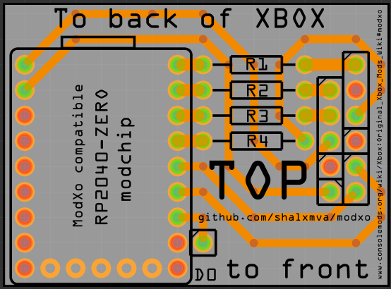
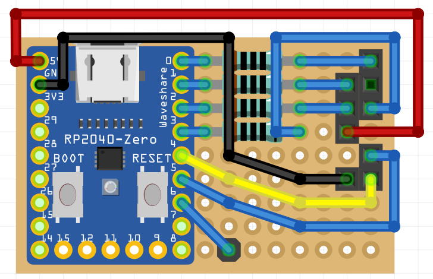

# RP2040-ZERO modchip adapter for Original Xbox

Unofficial board for the original Xbox modchip "[ModXo](https://github.com/shalxmva/modxo)" by Shalx

# Easy to solder

All components can be soldered 'though hole'.

Included schematics for 'hand soldering' the PCB on perf board:

# Fully open source

The Fritzing source file are included, so you can add/remove/move components based on your preferences.
But also the gerber files are created for easy ordering.

# License

GNU GENERAL PUBLIC LICENSE
Version 3, 29 June 2007

You can sell this board as-is, but disclose the source.
If you sell modifications of this board (additional headers for LED strips / LCD / fan), share the modifications / source files under the same license.

# More info

https://github.com/shalxmva/modxo
https://consolemods.org/wiki/Xbox:ModXo
